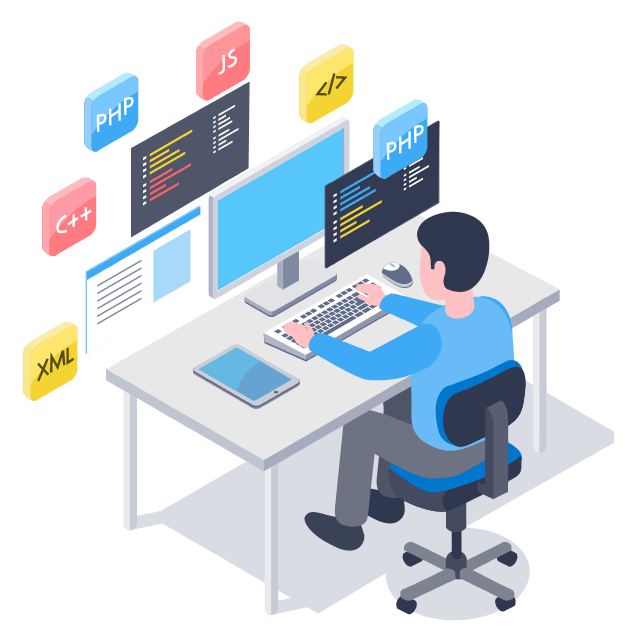

### Hi there 👋 I'm <a href="https:https://linktr.ee/Neerajpandey_pandey" target="_blank">	Neeraj pandey 
  

- 🔭 I’m currently working on Web development project
- 🌱 I’m currently learning DSA, Machine Learning, Web development
- 💬 Ask me about anything, I am happy to help;
- 📫 How to reach me pneeraj721@gmail.com

🌱 

#### 📫 How to reach me:
  
  &nbsp;   &nbsp;   &nbsp; <a href="mailto:pneeraj721@gmail.com"> 

#

#### 🧰 Languages and Tools
<table border="0">
 <tr>
    <td><b style="font-size:30px"> Languages </b></td>
    <td><b style="font-size:30px"> Frameworks and libraries </b></td>
 </tr>
 <tr>
    <td>
    

  
    </td>
    <td>
    
    

    </td>
 </tr>
  <tr>
    <td><b style="font-size:30px"> Development tools </b></td>
    <td><b style="font-size:30px"> Database </b></td>
 </tr>
  <tr >
    <td>
    

    </td>
    <td>
    

    </td>
 </tr>
</table>

 <em><b>I love connecting with different people</b> so if you want to say <b>hi, I'll be happy to meet you more!</b> 😊</em>

### 📊 My Github Stats

 

##
<h3>Github Contributions</h3>

---
<!-- 
<h3 align="center"> Show some ❤️ by ⭐ the repository!!!</h3>
 -->

